# D01_Linux.ID_356272-1: Linux Administration and Updates

## Part 1: OTni o‘rnatish (Ubuntu Server 20.04)

### Maqsad
- VirtualBox yordamida Ubuntu Server 20.04 ni **grafik interfeyssiz** o‘rnatish
- Terminal orqali OT versiyasini tekshirish

### Amalaga oshirilgan ishlar
- Ubuntu Server ISO fayli yuklab olindi
- VirtualBox’da yangi VM yaratildi
- Minimal konfiguratsiya bilan OT o‘rnatildi
- OT ishga tushgach, terminalda quyidagi buyruq bajarildi:

```bash
cat /etc/issue
```

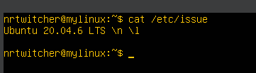

---

## Part 2: Foydalanuvchi bilan ishlash

### Maqsad
- Yangi foydalanuvchi yaratish
- Parolni sozlash
- Foydalanuvchini sudo guruhiga qo‘shish

### Amalaga oshirilgan ishlar

```bash
sudo adduser newuser
sudo usermod -aG sudo newuser
```

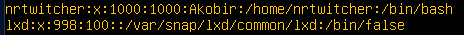

---

## Part 3: Tarmoq sozlamalari

### Maqsad
- Statik IP manzil o‘rnatish
- DNS, Gateway sozlash
- Ping orqali tarmoq aloqasini tekshirish
- Vaqtni sozlash

### Amalga oshirilgan ishlar

```bash
sudo nano /etc/netplan/00-installer-config.yaml
sudo netplan apply
ping -c 4 8.8.8.8
```

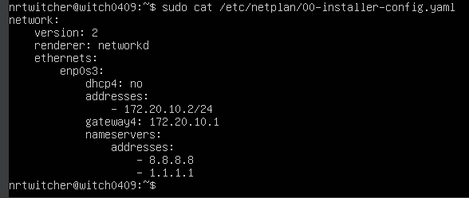
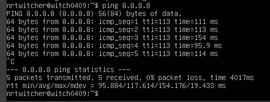
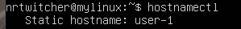
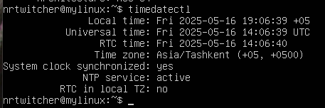
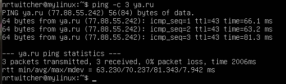
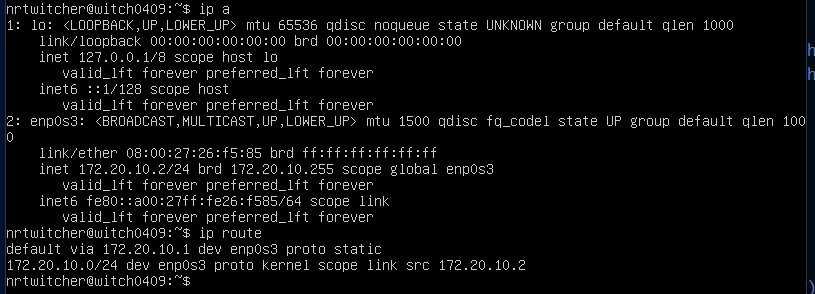

---

## Part 4: Operatsion tizimni yangilash

### Maqsad
Operatsion tizimdagi barcha paketlarni eng so‘nggi versiyalarga yangilash.

### Amalga oshirilgan ishlar

- Tizim paketlari `sudo apt update` va `sudo apt upgrade` buyruqlari yordamida yangilandi.
- Yangilash jarayoni davomida barcha kerakli paketlar muvaffaqiyatli o‘rnatildi.
- Yangilash oxirida tizimda yangilanishlar yo‘qligi haqida xabar olindi.

```bash
cat /etc/apt/sources.list
sudo apt update && sudo apt upgrade -y
```

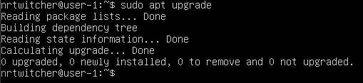

---

## Part 5: Sudo bilan ishlash

### Maqsad
- Linuxda sudo so'zining qisqartmasi SuperUser Do. U foydalanuvchilarga administrator imtiyozlari (root) bilan buyruqlarni bajarish imkonini beradi.

### Amalaga oshirilgan ishlar

- Part 2 da yaratilgan foydalanuvchiga `sudo` huquqlari berildi.
- `sudo` buyrug'i Linux tizimida foydalanuvchilarga ma'muriy huquqlarsiz bajarib bo‘lmaydigan operatsiyalarni vaqtinchalik bajarish imkonini beradi.
- `sudo` orqali xavfsizlikni ta’minlab, tizimni noto‘g‘ri yoki zararli o‘zgarishlardan himoya qilish mumkin.
- `sudo` yordamida foydalanuvchi hostname ni o'zgartirdi va tizim nomi muvaffaqiyatli yangilandi.


```bash
sudo usermod -aG sudo <witch0409>
sudo hostnamectl set-hostname yangi_hostname
hostnamectl
```

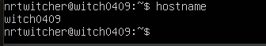

---

## Part 6: Vaqtni o'rnatish va sozlash

### Maqsad
Avtomatik vaqt sinxronizatsiya xizmatini sozlash, hozirgi vaqt zonasi va NTP sinxronizatsiyasi holatini tekshirish.

### Amalga oshirilgan ishlar:

1. Avtomatik vaqt sinxronizatsiyasi (NTP) xizmati yoqildi:
```bash
sudo timedatectl set-ntp true
```
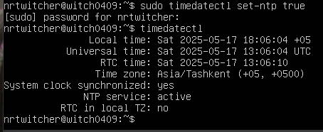
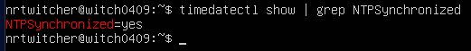

---

## Part 7: Matn muharrirlarini o'rnatish va ishlatish

### Maqsad
3 ta matn muharriri o'rnatish va ularda ishlash
- vim
- nano
- joe
1-bosqich: Har bir muharrirda yangi .txt fayl yaratildi

test_vim.txt
test_nano.txt
test_joe.txt

Muharrirdan chiqish (saqlash bilan):

Vim: ESC → :wq → Enter
Nano: Ctrl + O → Enter → Ctrl + X
Joe: Ctrl + K, so‘ng X (save and exit)

2-bosqich: Har bir fayl tahrirlandi, ammo saqlanmasdan chiqildi

Muharrirdan chiqish (saqlamasdan):

Vim: ESC → :q! → Enter
Nano: Ctrl + X → N tugmasi
Joe: Ctrl + C → Ctrl + C → Ctrl + K, keyin Q

3-bosqich: Har bir faylda matnni qidirish va almashtirish

Vim:
Qidirish: ESC → /nrtwitcher → Enter
Almashtirish: :%s/nrtwitcher/GHOST/g → Enter

Nano:
Ctrl + \ → nrtwitcher yoziladi → Enter
GHOST yoziladi → Enter
A tugmasi bosiladi (hammasini almashtirish uchun)

Joe:
Ctrl + K → F (Find) → nrtwitcher
Ctrl + K → R (Replace) → GHOST

```bash
sudo apt update
sudo apt install vim nano joe
```

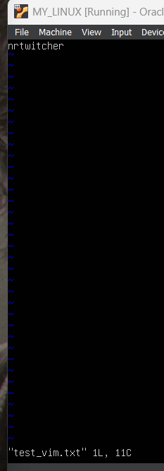
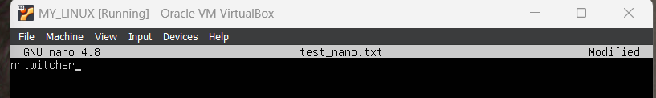
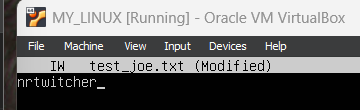
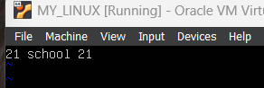
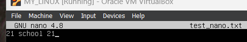
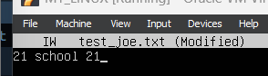

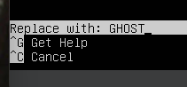
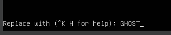

---

## Part 8: SSH xizmatini o‘rnatish va sozlash

### Maqsad

SSH xizmatini o‘rnatdim quyidagi buyruq orqali: sudo apt install openssh-server
SSH xizmatini avtomatik ishga tushirishga qo‘shish: sudo systemctl enable ssh

So‘ng quyidagi buyruq bilan 2022-port ochiq va tinglash holatida ekanini tekshirdim: sudo netstat -tan

SSH portini 2022 ga o‘zgartirish: sudo nano /etc/ssh/sshd_config, keyin esa ssh ni qayta ishga tushirdim - sudo systemctl restart ssh

SSH xizmatining ishlayotganini tekshirdim - ps -aux | grep sshd

netstat -tan buyruq izohi:
-t — faqat TCP portlarini korsatadi
-a — barcha portlarni (ochiq va bog'langan) ko'rsatadi
-n — port raqamlarini inson o'qiydigan nomlar o'rniga raqamli ko‘rinishda ko'rsatadi
Natijadagi ustunlar ma'nosi:
tcp — protokol
0 0 — bu portda hozircha ulanish yo'q
0.0.0.0:2022 — barcha interfeyslarda 2022-port tinglanmoqda
0.0.0.0:* — bu portga har qanday manzildan ulanilishi mumkin
LISTEN — port tinglash holatida, ya'ni ishga tayyor

```bash
sudo apt install openssh-server
sudo systemctl enable ssh
sudo netstat -tan
sudo nano /etc/ssh/sshd_config
sudo systemctl restart ssh
ps -aux | grep sshd
sudo apt install net-tools
```

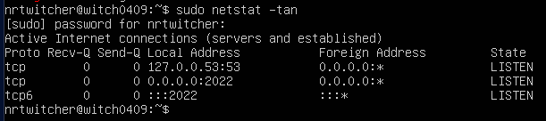

---

## Part 9: top va htop utilitalari

### Maqsad
- Resurslar monitoringi uchun top/htop utilitalaridan foydalanish
top
- Uptime - 21:10:34 up 4:29
- foydalanuvchilar soni - 1 user
- load average - 0.01 0.02 0.00
- total tasks - 105 total
- CPU - 0.0 us, 0.5 sy, 0.0 ni, 99.5 id, 0.0 wa, 0.0 hi, 0.0 si, 0.0 st
- most memory usage - 755
- most CPU usage - 1491
htop
-PID bo‘yicha saralangan
-%CPU bo‘yicha saralangan
-%MEM bo‘yicha saralangan
-sshd filtering
-syslog qidiruvi

```bash
top
htop
```

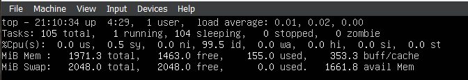
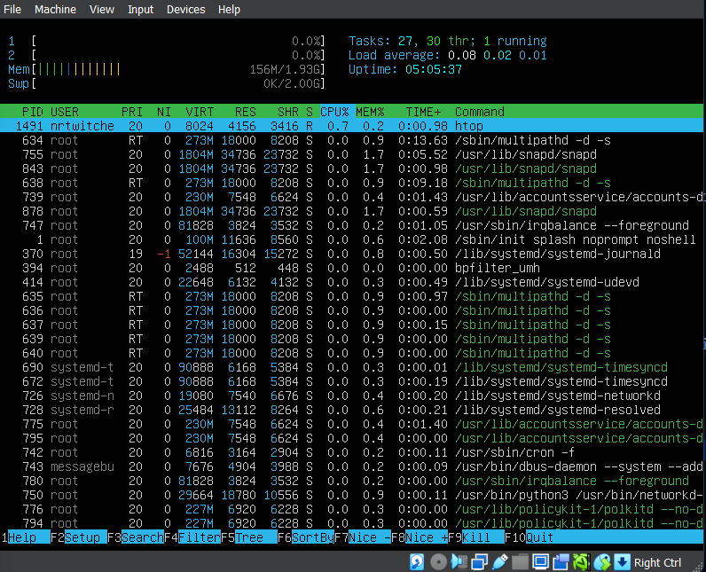
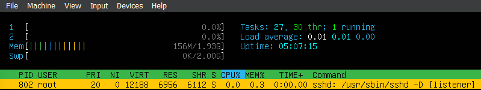


---

## Part 10: FDISK

### Maqsad
- Fdisk yordamida tizimdagi disklar haqida ma'lumot
 HISOBOT
 - disk nomi: /dev/sda
 - umumiy hajmi: 25 gb
 - sectorlar soni: 52,428,800
 - SWAP hajmi: 2 gb

```bash
sudo fdisk -l
```

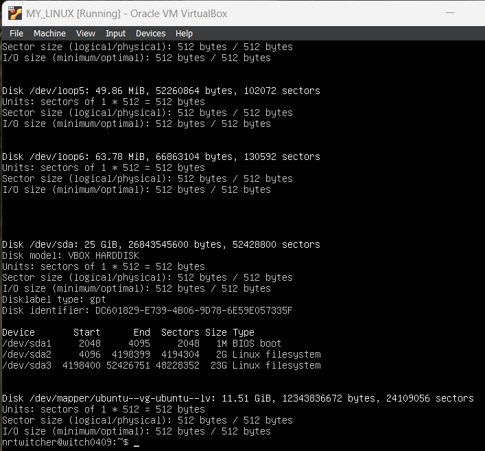

---

## Part 11: df Utilitasi

### Maqsad
 Disk maydoni haqida ma'lumotlar
- size: 11758760 (12gb)
- used: 5731776 (5.5 gb)
- available: 5407876 (5.2 gb)
- use%: 52%
- mounted on: /

```bash
df /
df -Th
```

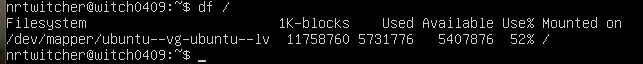
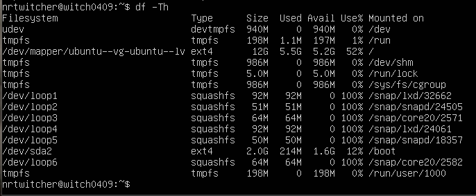

---

## Part 12: du Utilitasi

### Maqsad
- dpkg va apt bilan paketlarni boshqarish

```bash
du -sb /home /var /var/log
du -sh /home /var /var/log
du -sh /var/log/*
```
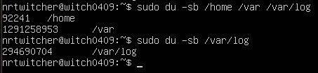
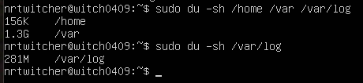
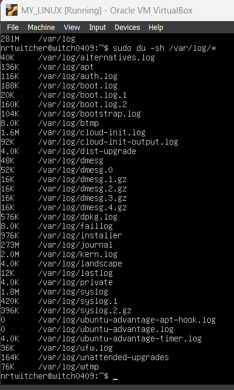
---

## Part 13: NCDU utility

### Maqsad
- `ncdu` (NCurses Disk Usage) — bu fayl tizimining hajmini tahlil qilish uchun qulay, interaktiv terminal interfeysga ega utilita hisoblanadi. Bu `du` buyrug‘i asosida ishlaydi, lekin vizual tarzda tahlil qilishni osonlashtiradi.


```bash
sudo apt update
sudo apt install ncdu
sudo ncdu
```
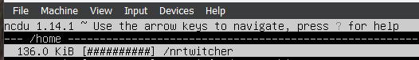
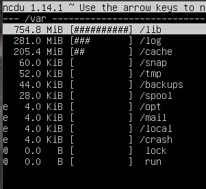
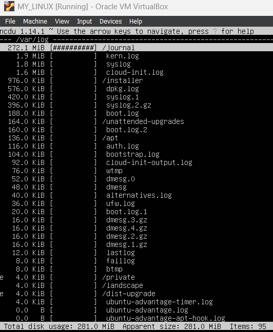
---

## Part 14: log fayllar bilan ishlash

### Maqsad
- last login: May 28, 16:18:14, nrtwitcher, tty1

```bash
sudo less /var/log/dmesg
sudo less /var/log/syslog
sudo less /var/log/auth.log

sudo systemctl restart ssh 
sudo journalctl -xe | grep ssh
sudo less /var/log/syslog
```
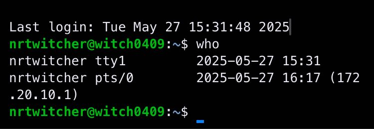
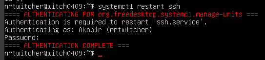
---

## Part 15: CRON planner

### Maqsad
- Har 2 daqiqada "uptime" buyrug'ini ishga tushirish

*/2 * * * * /usr/bin/uptime >> /home/nrtwitcher/uptime.log 2>&1

```bash
crontab -e
cat /home/nrtwitcher/uptime.log
grep "uptime" /var/log/syslog
crontab -l (check)
crontab -r (delete)
```
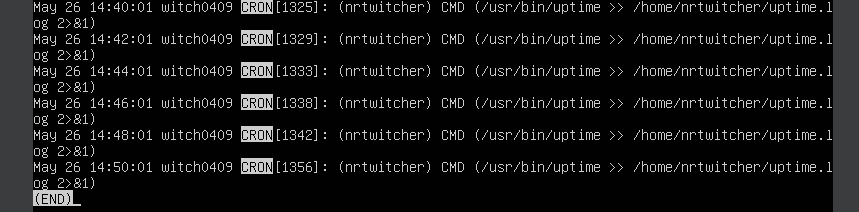

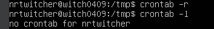
---
